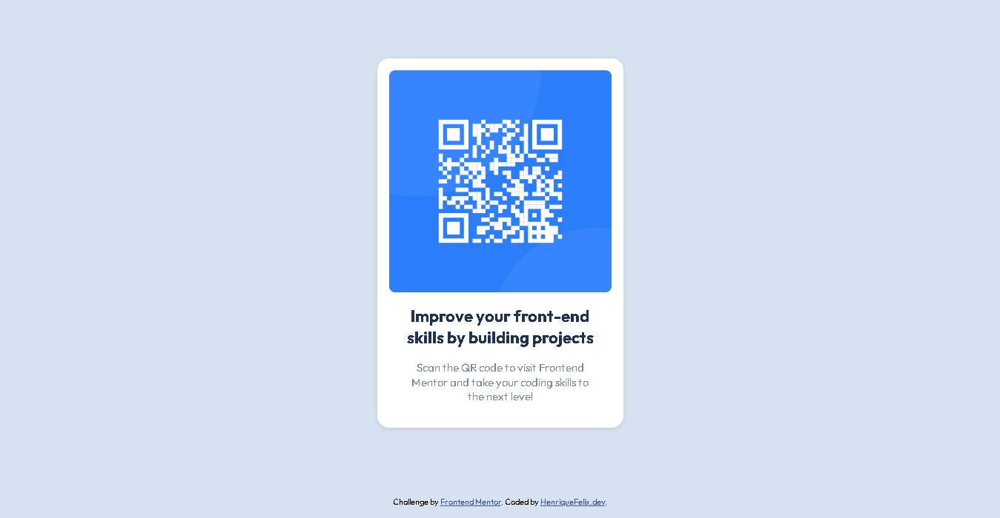

# Frontend Mentor - QR code component solution

Essa é a solução para o desafio [QR code component challenge no site Frontend Mentor](https://www.frontendmentor.io/challenges/qr-code-component-iux_sIO_H). Os desafios do Frontend Mentor ajudam a melhorar as habilidades de codificação construindo projetos reais.

## Table of contents

- [Overview](#overview)
  - [Screenshot](#screenshot)
  - [Links](#links)
- [Desenvolvimento](#desenvolvimento)
  - [Construído com](#construído-com)
  - [O que eu aprendi](#o-que-eu-aprendi)
    - [Sobre o BEM](#sobre-o-bem)
    - [Blocos (Blocks)](#blocos-blocks)
    - [Elementos (Elements)](#elementos-elements)
    - [Modificadores (Modifiers)](#modificadores-modifiers)
  - [Continued development](#continued-development)
  - [Recursos Úteis](#recursos-úteis)
- [Autor](#autor)

## Overview

### Screenshot

### Links

Para visualizar o projeto funcionado,  [acesse o link](https://henriquefelixdev.github.io/qr-code-frontend-mentor/)

## Desenvolvimento

### Construído com

- HTML5 semântico
- CSS customizado
- Flexbox
- Mobile-first workflow
- CSS Reset

### O que eu aprendi

#### Sobre o BEM
Para esse projeto foi utilizada a metodologia BEM do CSS que trabalha com os conceitos de BLOCOS, ELEMENTOS e MODIFICADORES.

#### Blocos (Blocks)
São partes maiores da UI que possui significado próprio, sem depender de outras partes. Por exemplo:
 - Header
 - Container
 - Menu
 - Etc.

#### Elementos (Elements)
Partes menores que fazem parte de um BLOCO. Não possui significado próprio e depende do BLOCO para fazer algum sentido. Por exemplo:
 - Itens de uma lista
 - Itens de menu
 - Título de um card
 - Etc.

#### Modificadores (Modifiers)
Servem para representar as mudanças de estado de um ELEMENTO ou BLOCO. Por exemplo:
 - Desabilitado
 - Selecionado
 - Fixo
 - Etc.

Se você deseja saber mais sobre a metodologia BEM, acesse o [Guia de BEM CSS](https://getbem.com/introduction/).

### Recursos Úteis

- [Meyer CSS Reset](https://meyerweb.com/eric/tools/css/reset/reset.css) - O CSS Reset permite que os elementos fiquem com a mesma aparência em diferentes navegadores.

## Autor

- Website - [HenriqueFelix.dev](https://henriquefelix.dev.br/)
- Frontend Mentor - [@HenriqueFelixDev](https://www.frontendmentor.io/profile/HenriqueFelixDev)
- Linkedin - [@HenriqueFelixDev](https://www.linkedin.com/in/henrique-felix-dev/)
